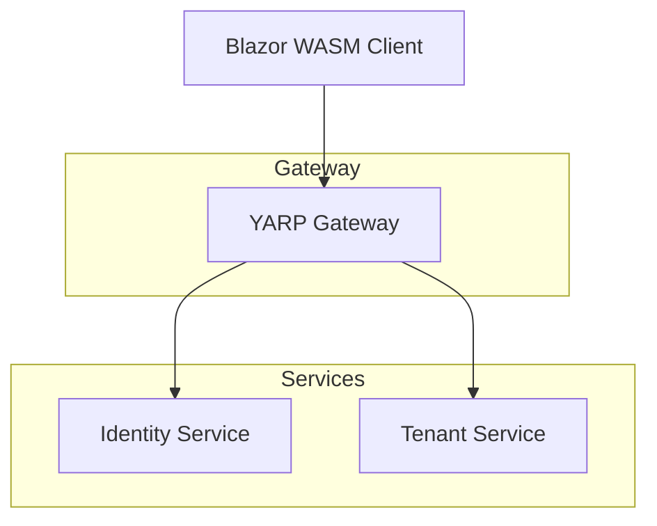

# C4 Generator Skill

Genera diagramas C4 de arquitectura para documentación técnica.

## Niveles C4

### Level 1: Context
```
┌─────────────────────────────────────────────────────┐
│                    My SaaS System                    │
│                                                     │
│   ┌─────────┐    ┌─────────┐    ┌─────────┐     │
│   │ Customer│    │   Admin │    │  External│     │
│   │   Web   │    │  Portal │    │   APIs   │     │
│   └────┬────┘    └────┬────┘    └────┬────┘     │
│        │               │               │           │
│        └───────────────┼───────────────┘           │
│                        │                           │
│                   ┌────┴────┐                      │
│                   │ YARP    │                      │
│                   │ Gateway │                      │
│                   └────┬────┘                      │
│                        │                           │
│        ┌───────────────┼───────────────┐          │
│        │               │               │          │
│   ┌────┴────┐    ┌────┴────┐    ┌────┴────┐     │
│   │ Identity│    │  Tenant │    │ Billing │     │
│   │ Service │    │ Service │    │ Service │     │
│   └─────────┘    └─────────┘    └─────────┘     │
└─────────────────────────────────────────────────────┘
```

### Level 2: Container
Cada microservicio como contenedor independiente.

### Level 3: Component
Componentes internos de cada contenedor.

### Level 4: Code
Diagrama de clases/key code.

## Formatos de Output

### PlantUML
```plantuml
@startuml
!include https://raw.githubusercontent.com/plantuml/、标准-lib/master/C4/C4_Container.puml

System(ysarp, "YARP Gateway", "API Gateway")
System(identity, "Identity Service", "Auth & Users")
System(tenant, "Tenant Service", "Multi-tenancy")

Container(blazor, "Blazor WASM", "Frontend")

Rel(blazor, yarp, "HTTP")
Rel(ysarp, identity, "HTTP")
Rel(ysarp, tenant, "HTTP")
@enduml
```

### Mermaid


### Markdown con ASCII
Para README.md simple.

## Ubicación

```
docs/
├── architecture/
│   ├── context.md
│   ├── containers.md
│   ├── components.md
│   └── diagrams/
│       ├── context.puml
│       └── containers.mmd
└── README.md
```

## Skills Auto-invocados

- `clean-arch-design` - Diseño de arquitectura
- `domain-analysis` - Bounded contexts
- `dapr-microservices` - Servicios distributed

## Reglas

1. **Niveles progresivos** -Context → Container → Component
2. **Technologies explícitas** - qué tecnología usa cada container
3. **Data flows claros** - cómo fluye la información
4. **External systems** - APIs externas documentadas
